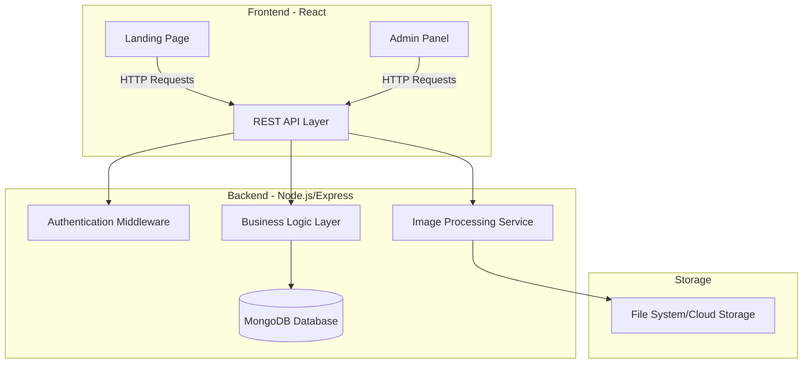

# Design Document

## Overview

The MERN Showcase Platform is a full-stack web application built using MongoDB, Express.js, React, and Node.js. The system consists of two main interfaces: a public-facing landing page for visitors to view projects and client testimonials, submit contact information, and subscribe to newsletters; and an administrative panel for managing all content and viewing submissions.

The architecture follows a client-server model with a RESTful API, separating concerns between the frontend presentation layer and backend business logic. Image processing capabilities are integrated to ensure visual consistency across the platform.

## Architecture

### High-Level Architecture



### Technology Stack

**Frontend:**
- React 18+ for UI components
- React Router for navigation
- Axios for HTTP requests
- React Cropper or similar library for image cropping
- CSS Modules or Styled Components for styling

**Backend:**
- Node.js (v18+)
- Express.js for REST API
- Mongoose for MongoDB ODM
- Multer for file uploads
- Sharp for server-side image processing
- JWT for authentication
- bcrypt for password hashing

**Database:**
- MongoDB for data persistence

**Additional Tools:**
- dotenv for environment configuration
- CORS for cross-origin requests
- express-validator for input validation

## Components and Interfaces

### Frontend Components

#### Landing Page Components

1. **ProjectsSection**
   - Fetches and displays all projects
   - Renders project cards with image, name, description, and a "Read More" button (non-functional)
   - Handles loading and error states

2. **HappyClientsSection**
   - Fetches and displays all client testimonials
   - Renders client cards with image, name, description, and designation
   - Implements responsive grid layout

3. **ContactForm**
   - Manages form state for full name, email, mobile number, and city
   - Validates input fields
   - Submits data to backend API
   - Displays success/error messages

4. **NewsletterSection**
   - Manages email input state
   - Validates email format
   - Submits subscription to backend API
   - Displays confirmation messages

#### Admin Panel Components

1. **AdminLayout**
   - Provides navigation between admin sections
   - Handles authentication state
   - Displays logout functionality

2. **ProjectManagement**
   - Form for adding new projects (image, name, description)
   - Image cropper for project images
   - List view of existing projects
   - Delete/edit functionality for projects

3. **ClientManagement**
   - Form for adding new clients (image, name, description, designation)
   - Image cropper for client images
   - List view of existing clients
   - Delete/edit functionality for clients

4. **ContactSubmissions**
   - Table view of all contact form submissions
   - Displays full name, email, mobile number, city
   - Search and filter capabilities

5. **NewsletterSubscriptions**
   - Table view of all subscribed email addresses
   - Export functionality for email list
   - Search capabilities

6. **LoginPage**
   - Authentication form
   - Credential validation
   - Session management

### Backend API Endpoints

#### Public Endpoints

```
GET    /api/projects              - Fetch all projects
GET    /api/clients               - Fetch all clients
POST   /api/contact               - Submit contact form
POST   /api/newsletter/subscribe  - Subscribe to newsletter
POST   /api/auth/login            - Admin login
```

#### Protected Admin Endpoints

```
POST   /api/admin/projects        - Create new project
GET    /api/admin/projects        - Get all projects (admin view)
PUT    /api/admin/projects/:id    - Update project
DELETE /api/admin/projects/:id    - Delete project

POST   /api/admin/clients         - Create new client
GET    /api/admin/clients         - Get all clients (admin view)
PUT    /api/admin/clients/:id     - Update client
DELETE /api/admin/clients/:id     - Delete client

GET    /api/admin/contacts        - Get all contact submissions
DELETE /api/admin/contacts/:id    - Delete contact submission

GET    /api/admin/subscriptions   - Get all newsletter subscriptions
DELETE /api/admin/subscriptions/:id - Delete subscription
```

### Middleware Components

1. **Authentication Middleware**
   - Verifies JWT tokens
   - Protects admin routes
   - Handles token expiration

2. **Validation Middleware**
   - Validates request body data
   - Sanitizes inputs
   - Returns validation errors

3. **Error Handling Middleware**
   - Catches and formats errors
   - Returns consistent error responses
   - Logs errors for debugging

4. **Image Upload Middleware**
   - Handles multipart form data
   - Validates file types (images only)
   - Limits file sizes

## Data Models

### Project Model

```javascript
{
  _id: ObjectId,
  name: String (required, max 200 chars),
  description: String (required, max 1000 chars),
  image: String (required, URL or path),
  createdAt: Date (auto-generated),
  updatedAt: Date (auto-generated)
}
```

### Client Model

```javascript
{
  _id: ObjectId,
  name: String (required, max 100 chars),
  description: String (required, max 500 chars),
  designation: String (required, max 100 chars),
  image: String (required, URL or path),
  createdAt: Date (auto-generated),
  updatedAt: Date (auto-generated)
}
```

### Contact Model

```javascript
{
  _id: ObjectId,
  fullName: String (required, max 100 chars),
  email: String (required, valid email format),
  mobileNumber: String (required, valid phone format),
  city: String (required, max 100 chars),
  submittedAt: Date (auto-generated),
  isRead: Boolean (default: false)
}
```

### Newsletter Model

```javascript
{
  _id: ObjectId,
  email: String (required, unique, valid email format),
  subscribedAt: Date (auto-generated),
  isActive: Boolean (default: true)
}
```

### Admin Model

```javascript
{
  _id: ObjectId,
  username: String (required, unique),
  password: String (required, hashed),
  email: String (required, unique, valid email format),
  createdAt: Date (auto-generated),
  lastLogin: Date
}
```

## Correctness Properties

*A property is a characteristic or behavior that should hold true across all valid executions of a system—essentially, a formal statement about what the system should do. Properties serve as the bridge between human-readable specifications and machine-verifiable correctness guarantees.*


### Property Reflection

After analyzing all acceptance criteria, several redundancies were identified:
- Properties 1.3, 2.3, and 7.3 are redundant with 1.2, 2.2, and 7.2 respectively (all test complete rendering of data)
- Properties 9.1 and 9.2 can be combined into a single property about image cropping
- Properties 11.1 and 11.2 can be combined into a single property about JSON API responses

These redundant properties will be consolidated to avoid duplicate testing while maintaining comprehensive coverage.

### Correctness Properties

**Property 1: Complete project rendering**
*For any* project returned by the backend, the rendered project component should display the project image, project name, project description, and a "Read More" button (non-functional).
**Validates: Requirements 1.2, 1.3**

**Property 2: Complete client rendering**
*For any* client returned by the backend, the rendered client component should display the client image, client name, client description, and client designation.
**Validates: Requirements 2.2, 2.3**

**Property 3: Contact form data persistence round-trip**
*For any* valid contact form submission (full name, email, mobile number, city), storing the data in the database and then retrieving it should return all fields with identical values.
**Validates: Requirements 3.3**

**Property 4: Contact form validation prevents empty submissions**
*For any* contact form submission where one or more required fields are empty, the system should prevent submission and display validation messages.
**Validates: Requirements 3.5**

**Property 5: Newsletter subscription persistence round-trip**
*For any* valid email address submitted for newsletter subscription, storing it in the database and then retrieving it should return the same email address.
**Validates: Requirements 4.3**

**Property 6: Email format validation**
*For any* string that does not match valid email format, the newsletter subscription form should reject the submission and display a validation message.
**Validates: Requirements 4.5**

**Property 7: Project creation persistence round-trip**
*For any* valid project data (image, name, description) submitted by an admin, storing it in the database and then retrieving it should return all fields with identical values.
**Validates: Requirements 5.3**

**Property 8: Project appears in list after creation**
*For any* project successfully created by an admin, fetching the project list should include the newly created project.
**Validates: Requirements 5.4**

**Property 9: Project validation prevents empty submissions**
*For any* project submission where one or more required fields are empty, the system should prevent submission and display validation messages.
**Validates: Requirements 5.5**

**Property 10: Client creation persistence round-trip**
*For any* valid client data (image, name, description, designation) submitted by an admin, storing it in the database and then retrieving it should return all fields with identical values.
**Validates: Requirements 6.3**

**Property 11: Client appears in list after creation**
*For any* client successfully created by an admin, fetching the client list should include the newly created client.
**Validates: Requirements 6.4**

**Property 12: Client validation prevents empty submissions**
*For any* client submission where one or more required fields are empty, the system should prevent submission and display validation messages.
**Validates: Requirements 6.5**

**Property 13: Complete contact submission rendering**
*For any* contact submission returned by the backend, the admin panel should display the full name, email address, mobile number, and city.
**Validates: Requirements 7.2, 7.3**

**Property 14: Image cropping to specified dimensions**
*For any* image uploaded by an admin (for projects or clients), the stored image should have dimensions of 450 x 350 pixels.
**Validates: Requirements 9.1, 9.2, 9.3**

**Property 15: Unauthenticated access redirects to login**
*For any* attempt to access admin panel routes without valid authentication, the system should redirect to the login page.
**Validates: Requirements 10.1**

**Property 16: Valid credentials grant access**
*For any* admin user with valid credentials, successful login should grant access to the admin panel.
**Validates: Requirements 10.2**

**Property 17: Invalid credentials deny access**
*For any* login attempt with invalid credentials, the system should display an error message and prevent access to the admin panel.
**Validates: Requirements 10.3**

**Property 18: API returns valid JSON responses**
*For any* GET request to public API endpoints (/api/projects, /api/clients), the backend should respond with valid JSON format containing the requested data.
**Validates: Requirements 11.1, 11.2**

**Property 19: API returns appropriate status codes**
*For any* API request, the backend should return appropriate HTTP status codes (2xx for success, 4xx for client errors, 5xx for server errors).
**Validates: Requirements 11.3, 11.4, 11.5**

## Error Handling

### Frontend Error Handling

1. **Network Errors**
   - Display user-friendly error messages when API requests fail
   - Implement retry mechanisms for transient failures
   - Show loading states during API calls

2. **Validation Errors**
   - Display inline validation messages for form fields
   - Prevent form submission until all validations pass
   - Highlight invalid fields with visual indicators

3. **Authentication Errors**
   - Redirect to login page when session expires
   - Display clear error messages for invalid credentials
   - Handle token refresh failures gracefully

4. **Image Upload Errors**
   - Validate file types before upload
   - Display error messages for oversized files
   - Handle upload failures with retry options

### Backend Error Handling

1. **Database Errors**
   - Catch and log database connection errors
   - Return 500 status codes for database failures
   - Implement connection retry logic

2. **Validation Errors**
   - Use express-validator for input validation
   - Return 400 status codes with detailed error messages
   - Sanitize inputs to prevent injection attacks

3. **Authentication Errors**
   - Return 401 for invalid credentials
   - Return 403 for unauthorized access attempts
   - Log failed authentication attempts

4. **File Processing Errors**
   - Validate image formats and sizes
   - Handle image processing failures gracefully
   - Clean up temporary files on errors

5. **General Error Handling**
   - Implement global error handler middleware
   - Log all errors with appropriate severity levels
   - Return consistent error response format

## Testing Strategy

The testing strategy employs a dual approach combining unit tests and property-based tests to ensure comprehensive coverage and correctness.

### Unit Testing

Unit tests will verify specific examples, edge cases, and integration points:

**Frontend Unit Tests:**
- Component rendering with mock data
- Form submission handlers
- Navigation and routing
- Error state handling
- Loading state handling

**Backend Unit Tests:**
- API endpoint responses
- Middleware functionality
- Authentication logic
- Database model methods
- Error handling middleware

**Tools:**
- Jest for test runner
- React Testing Library for component tests
- Supertest for API endpoint tests
- MongoDB Memory Server for database tests

### Property-Based Testing

Property-based tests will verify universal properties across all inputs using fast-check library for JavaScript/TypeScript. Each property-based test will run a minimum of 100 iterations to ensure thorough coverage.

**Property Test Implementation Requirements:**
- Each property-based test MUST be tagged with a comment referencing the correctness property from this design document
- Tag format: `// Feature: mern-showcase-platform, Property {number}: {property_text}`
- Each correctness property MUST be implemented by a SINGLE property-based test
- Tests MUST use the fast-check library for generating random test data
- Tests MUST be configured to run at least 100 iterations

**Property Tests to Implement:**
- Data persistence round-trips (Properties 3, 5, 7, 10)
- Validation behavior (Properties 4, 6, 9, 12)
- Rendering completeness (Properties 1, 2, 13)
- Image processing (Property 14)
- Authentication behavior (Properties 15, 16, 17)
- API response format and status codes (Properties 18, 19)
- List updates after creation (Properties 8, 11)

**Example Property Test Structure:**
```javascript
// Feature: mern-showcase-platform, Property 3: Contact form data persistence round-trip
test('contact form data round-trip', () => {
  fc.assert(
    fc.property(
      fc.record({
        fullName: fc.string({ minLength: 1, maxLength: 100 }),
        email: fc.emailAddress(),
        mobileNumber: fc.string({ minLength: 10, maxLength: 15 }),
        city: fc.string({ minLength: 1, maxLength: 100 })
      }),
      async (contactData) => {
        const saved = await saveContact(contactData);
        const retrieved = await getContact(saved._id);
        expect(retrieved).toMatchObject(contactData);
      }
    ),
    { numRuns: 100 }
  );
});
```

### Integration Testing

Integration tests will verify end-to-end workflows:
- Complete user journeys (viewing projects, submitting forms)
- Admin workflows (adding projects/clients, viewing submissions)
- Authentication flows
- Image upload and processing pipelines

### Test Coverage Goals

- Minimum 80% code coverage for backend
- Minimum 70% code coverage for frontend
- 100% coverage of API endpoints
- All correctness properties implemented as property-based tests

## Security Considerations

1. **Authentication & Authorization**
   - JWT tokens with expiration
   - Secure password hashing with bcrypt
   - Protected admin routes
   - HTTPS in production

2. **Input Validation**
   - Server-side validation for all inputs
   - Sanitization to prevent XSS attacks
   - SQL/NoSQL injection prevention
   - File upload restrictions

3. **Data Protection**
   - Environment variables for sensitive data
   - Secure database connections
   - CORS configuration
   - Rate limiting on API endpoints

4. **Image Security**
   - File type validation
   - File size limits
   - Secure file storage
   - Prevention of malicious file uploads

## Performance Considerations

1. **Frontend Optimization**
   - Lazy loading for images
   - Code splitting for routes
   - Memoization of expensive computations
   - Debouncing for search/filter inputs

2. **Backend Optimization**
   - Database indexing on frequently queried fields
   - Pagination for large datasets
   - Caching for static content
   - Compression for API responses

3. **Image Optimization**
   - Image compression during processing
   - Responsive image serving
   - CDN for image delivery (optional)
   - Lazy loading on frontend

## Deployment Architecture

### Development Environment
- Local MongoDB instance
- Node.js development server
- React development server with hot reload

### Production Environment
- MongoDB Atlas or self-hosted MongoDB
- Node.js server (PM2 for process management)
- React build served via Express static files or separate CDN
- Environment-based configuration
- SSL/TLS certificates

### Environment Variables

```
# Backend
PORT=5000
MONGODB_URI=mongodb://localhost:27017/showcase
JWT_SECRET=your_jwt_secret
JWT_EXPIRE=7d
NODE_ENV=development

# Frontend
REACT_APP_API_URL=http://localhost:5000/api
```

## Future Enhancements

1. **Content Management**
   - Rich text editor for descriptions
   - Bulk upload for projects/clients
   - Draft/publish workflow

2. **Analytics**
   - View counts for projects
   - Contact form submission analytics
   - Newsletter subscription tracking

3. **User Features**
   - Project categories/tags
   - Search and filter on landing page
   - Social media sharing

4. **Admin Features**
   - Multiple admin roles
   - Activity logs
   - Email notifications for new submissions
   - Export data to CSV

5. **Performance**
   - Server-side rendering (SSR)
   - Progressive Web App (PWA) features
   - Advanced caching strategies
